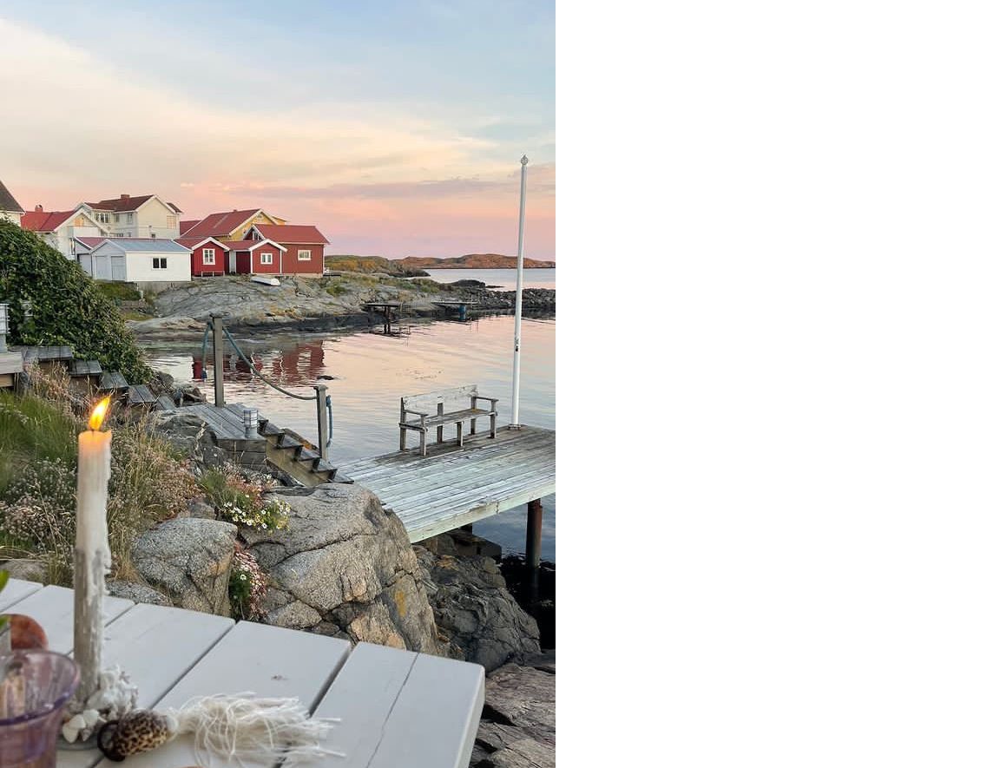

---
hide:
  - navigation
  - toc
---

  

  <h1 class="hero-title">Anneke is 21!</h1>
  
Mid sommar

  
Je bent van harte uitgenodigd voor het <strong>21-diner</strong> van Anneke! 
  We vieren deze bijzondere mijlpaal in Mid sommar-stijl. 
  Denk aan lichte tinten, natuurlijke elementen en gezelligheid!

  

    
Datum

    
Zaterdag 27 juni 2026

  

  

    
Tijd

    
Vanaf 17:00 uur

  

  

    
Locatie

    
Langs de Rijn 5 Wijk bij Duurstede

  

---

  
<strong>Graag bevestigen vóór 15 juni 2026</strong>

  
Vul het formulier in en laat weten of je erbij bent.

  

    <a href="https://docs.google.com/forms/d/e/1FAIpQLSd8dyXdwgWp8mLSqgznVnuYdv1wpG5c0gKqZJnmdVsggX2gSg/viewform"
       target="_blank"
       style="display:inline-block; background:#6B8C6E; color:white; padding:0.6rem 1.8rem; font-size:0.8rem; letter-spacing:0.12em; text-transform:uppercase; border:none; text-decoration:none; font-weight:500;">
      Aanmelden
    </a>
  

