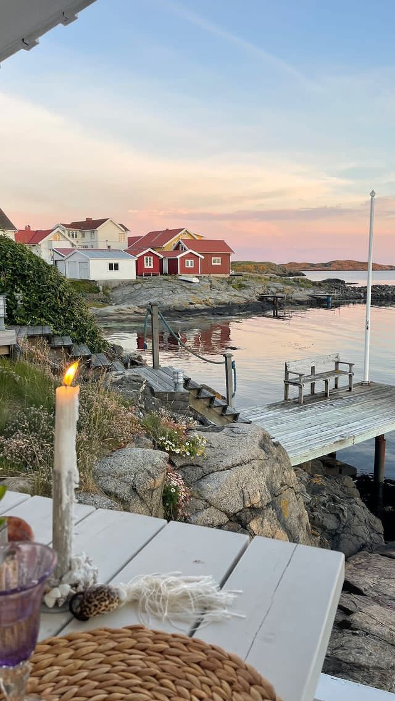

  
  

    <h1 class="hero-title">Anneke wordt 21!</h1>
    
🌿 Scandinavian Summer 🌿

  

Je bent van harte uitgenodigd voor het **21-jaarsdiner** van Anneke!

We vieren deze bijzondere mijlpaal in Scandinavische zomerstijl.  
Denk aan lichte tinten, natuurlijke elementen en gezelligheid!

  

    
📅

    
Datum

    
Zaterdag 27 juni 2026

  

  

    
🕐

    
Tijd

    
Vanaf 17:00 uur

  

  

    
📍

    
Locatie

    
Langs de Rijn 5 Wijk bij Duurstede

  

---

## 🌾 Wat kun je verwachten?

- Een heerlijk diner in Scandinavische stijl
- Gezellig samenzijn met familie en vrienden
- Zomerse sfeer aan de Rijn

---

  
<strong>Graag bevestigen vóór 15 juni 2026</strong>

  
We hopen je te zien! ✨

